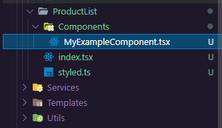
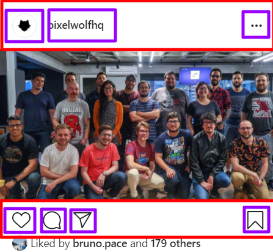
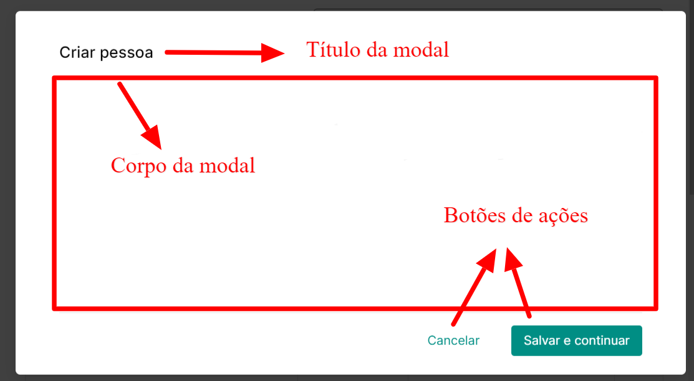
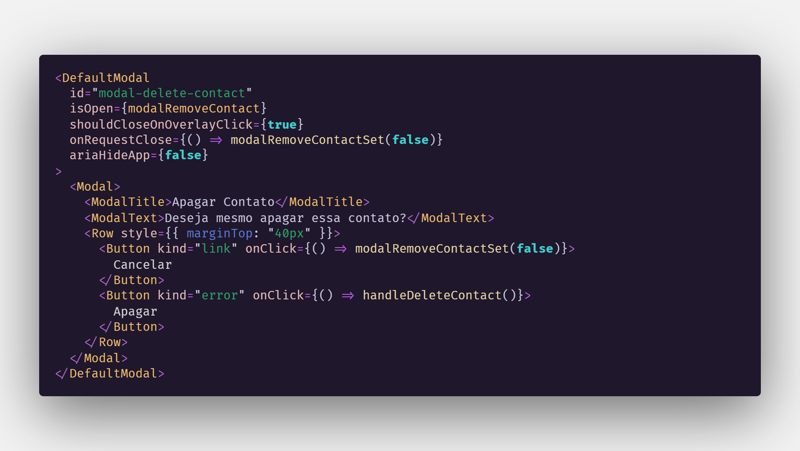
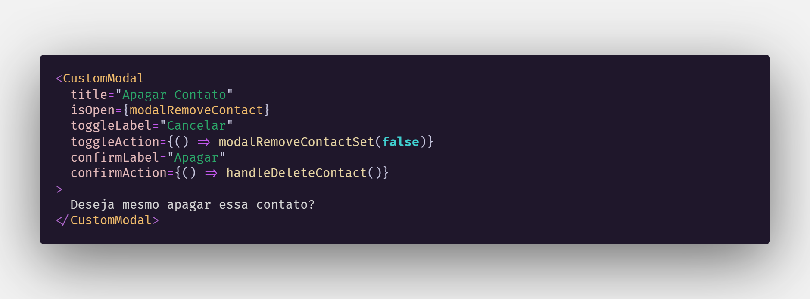

# O problema

Uma das minhas maiores dores no desenvolvimento de aplicações front-end é quando abro um componente desenvolvido por um colega e vejo que este possui 2 mil linhas em um único arquivo. Para mim, isso é ruim pois demora para conseguir entender o que de fato todas aquelas linhas fazem - isso quando eu entendo. Então torna-se necessário desprender de uma quantidade x de tempo para ir lendo tudo até fazer, de fato, o eu precisava inicialmente. Para resolver ou, pelo menos, amenizar esse problema há algumas técnicas que podem ser utilizadas e é sobre isso que venho tratar aqui.

## O velho e o novo testamento

Como já citei anteriormente, as vezes, no nosso dia a dia de desenvolvimento acabamos deixando um componente tão grande que caberiam 2 bíblias dentro dele 🤣.

Para citar alguns dos problemas de componentes desse tamanho seria:

### Dificuldade na legibilidade da página

Com páginas muito grandes o processo de leitura acaba demorando mais e, por consequência, o entendimento também. Demora-se mais tempo para conseguir entender o que cada método, função ou trecho de código executa e quando executa. 

### Baixa manutenibilidade

É comum ver que nesses tipos arquivos há uma grande dependência de pedaços diferentes do código. Desta forma, se você precisa alterar um trecho X ele pode afetar algum outro trecho indesejado.

### Alta possibilidade de código duplicado

Também se torna comum ver que em arquivos desse tipo há uma grande quantidade de códigos exatamente iguais ou, pelo menos, muito parecido onde uma ou outra coisa que é diferente. 

### Coleguinha pistola

Ninguém gosta da sensação que se tem ao abrir um arquivo e pensar "eu não faço idéia do que tem aqui!". O seu coleguinha não gosta e você provavelmente também não.

> OBS: Nos exemplos que cito abaixo estarei usando Reactjs, mas nada impede que você aplique os conceitos em outras bibliotecas/frameworks. 

## Virando o jogo

Para virar o jogo e começar a criar componentes que sejam mais manuteníveis, fáceis de ler, aproveitar da reutilização e, não menos importante, deixar os coleguinhas mais felizes é interessante levar em consideração algumas boas práticas enquanto estiver escrevendo seus componentes. Na internet encontramos diversos posts/artigos com diversas dicas do que pode ser feito para ter componentes mais manuteníveis e simples. Aqui não irei tratar uma especificamente, mas sim de um pedacinho de cada coisa que vi e que fazem sentido para mim. Caso você tenha interesse em se aprofundar mais no assunto recomendo muito que busque por *[Atomic Design](https://bradfrost.com/blog/post/atomic-web-design/)*.  

### Componentes genéricos reutilizáveis
Ficar atento toda vez que estiver notando que há coisas demais se repetindo no código. Se está repetindo exatamente igual ou muito próximo disso provavelmente esse trecho de código pode virar um componente isolado.

Para deixar mais claro, podemos ter como exemplo várias coisas comuns, como: modais, botões, headers, footers, títulos, sidebars, cards, caixas de alertas e muitas outras coisas. O sistema que você está desenvolvendo pode ter esses exemplos que citei, como podem ter outros totalmente diferentes. Vai ir da sua percepção saber se aquilo que está sendo desenvolvido pode ser reutilizado por outras páginas do sistema. Se a resposta for sim, então componentize!

### Componentes específicos não reutilizáveis
Há situações onde trechos de códigos estão se repetindo, porém, não é algo que poderá ser reutilizado em outras partes do sistema. É algo tão específico que somente aquela página terá aquela funcionalidade.

Mesmo em casos assim, se a página está ficando muito grande, é interessante fazer a componentização deste trecho, porém, com uma diferença. No lugar de colocar esse componente na pasta `src/Components` você o colocará na numa pasta `Components` dentro da pasta da sua *Página*. 

Por exemplo, imagine que você tenha uma a página de listagem de produtos no diretório `/src/Pages/ProductList/index.tsx` e nela há um componente que não é reutilizável por outras páginas do sistema, mas que pelo tamanho que ele está ficando você deseja criar um arquivo exclusivamente para esse componente. Algo que poderia ser feito seria criar esse componente dentro de uma pasta `Components`, com o caminho desse componente ficando assim: `/src/Pages/ProductList/Components/MyExampleComponent.tsx`.
Desta forma, todos os componentes exclusivos da pagina `ProductList` estaria dentro desta pasta, facilitando a identificação do que está alí dentro é algo que não é reutilizável, mas que foi componetizado para simplificar a complexidade da página `ProductList`

### Componentes de componentes

Outra situação em que é possível fazer componentes é quando temos dois ou mais componentes e que juntos se tornam um outro componente. Tipo aquele botão e input que juntos viram uma barra de busca, sacou?

Observe a imagem acima. As caixas em roxo são os componentes "Micro", ou seja, componentes pequenos que possuem uma ação bem específica. Já as caixas vermelhas temos os "Macros" ou componentes de de componentes. Um componente "Macro" é um componente maior que junta vários outros componentes menores dentro de sí. Assim, também facilita a reutilização pois toda vez que precisarmos daquele conjunto de componentes juntos podemos utilizar esse componente maior no lugar de ficar chamando cada componente pequeno um por um. 

As aplicações para esse tipo de componentização são diversas. Você pode, por exemplo, querer criar um componente de uma biblioteca que você usa para que que a chamada dele fique mais simples que é o exemplo que darei a seguir:

 Nas imagens abaixos veja que há dois exemplos de componentes, o primeiro é o **DefaultModal** e o segundo é **CustomModal**. Observe  que o **CustomModal** está bem mais simples, sem precisar colocar tanta coisa no meio do componente e esses dois componentes fazem a mesma coisa. A diferença é que no **CustomModal** foi criado um componente que encapsula o código da primeira imagem, expondo apenas algumas props com os dados que de fato alteram e também  permite que seja passado um "*filho*" no corpo da modal para que você possa adicionar elementos mais customizáveis. Desta forma, o título, os botões de ações, as funções que checa se modal está aberta ou fechada, ficam tudo "escondidas" para quem está usando a versão **CustomModal** .  

### Reutilização sem componentes 
Nem todo código repetido nos componentes podem sem quebrados em outros componentes menores.Também temos códigos repetidos que são lógicas para tratar algum problema, coisas como: formatação de datas, buscar um endereço com base num cep, tratamento de dados e coisas do tipo. Mesmo nesses casos ainda sim podemos fazer uso da reutilização, pode-se pegar esse trecho de lógica repetida, criar uma função que fica responsável pela aquela atividade e colocá-la dentro de uma pasta `src/utils` na raiz do projeto. Desta forma, toda vez que você precisar, por exemplo, buscar um endereço com base no CEP, você pode importar a função `getAddressByCep` do seu `utils` sem precisar copiar e colar o mesmo trecho de código para uma nova página.  

## Finalizando

Tentei neste artigo mostrar algumas dicas para escrever um código que seja, pelo menos, um pouco mais manutenível. Tentei passar um pouco da minha experiência do assunto, então pode ser que tenha algo que não caiba na realidade do projeto que você está trabalhando. Caso tenha curtido o tema, sugiro novamente que pesquise por *[Atomic Design](https://bradfrost.com/blog/post/atomic-web-design/)* e também se tiver algo para acrescentar ficaria agradecido se  compartilhasse comigo também, assim podemos sempre ir evoluindo. 

## Referências

[Componentização no front-end I](https://inside.contabilizei.com.br/componentiza%C3%A7%C3%A3o-no-front-end-3fc889a363df)

[Componentização no front-end IV](https://inside.contabilizei.com.br/componentiza%C3%A7%C3%A3o-no-front-end-f40b0b85143f)

[Estruturando camadas de uma arquitetura no React](https://dev.to/telles/tips-estruturando-as-camadas-de-uma-arquitetura-react-36bp)

[Atomic design](https://www.listennotes.com/podcasts/elemencast/1-atomic-design-lan%C3%A7amento-7IoMB4gnhcm/)